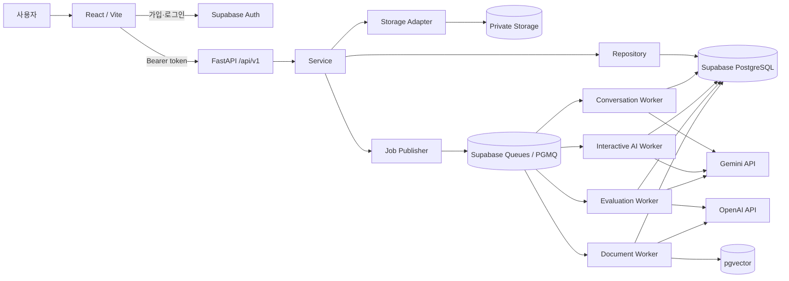

# K-Manner Speech API

> 관계와 상황에 맞는 한국어 표현을 연습하는 AI 화용 학습 서비스의 API·비동기 AI 처리 서버

[프론트엔드](https://github.com/K-manner-speech/k-manner-speech-advanced-front) · [API 명세](docs/API명세.md) · [아키텍처](docs/아키텍처.md) · [ERD](docs/ERD.md) · [PRD](docs/PRD.md)

## 프로젝트 소개

K-Manner Speech는 외국인 한국어 학습자가 문법을 넘어 **상대방과의 관계·상황·목적에 알맞은 표현**을 연습하도록 돕는 AI 회화 학습 서비스입니다.

학습자는 AI 페르소나와 텍스트 또는 음성으로 자유 대화와 상황별 회화를 연습하고, 자신의 표현이 상대에게 줄 수 있는 인상과 더 자연스러운 대안을 확인할 수 있습니다. 이력서와 지원 조건을 등록하면 문서 근거를 검색하는 RAG 파이프라인으로 사용자별 면접 질문과 평가도 제공합니다.

이 저장소는 FastAPI REST API, 사용자 소유 데이터 접근 제어, PGMQ 기반 비동기 AI Job, Gemini·OpenAI 연동, Supabase PostgreSQL·Storage·pgvector migration을 담당합니다.

## 주요 기능

| 영역 | 기능 |
| --- | --- |
| 인증·사용자 | Supabase Auth active session 검증, 온보딩, 프로필, 회원 탈퇴 |
| AI 회화 | 자유 채팅·상황 시나리오·면접 대화, 페르소나와 최근 문맥 유지 |
| 음성 | 감정·인상 추정, 스트리밍 TTS와 완성 음성 fallback |
| 학습 피드백 | 높임법·예의·상황 적합성·자연스러움 평가와 대안 표현 |
| 맞춤 면접 | PDF/DOCX 분석, pgvector 검색, RAG 질문 생성과 5개 항목 평가 |
| 결과·복습 | 종료 시점 snapshot 기반 결과, 강점·보완점·근거 제공 |
| 비동기 처리 | 작업별 deadline·retry·DLQ·heartbeat·stale result 방어 |

감정과 인상은 사실이 아닌 AI의 추정으로 다룹니다. 음성·피드백 등 부가 처리가 실패해도 가능한 텍스트 학습 흐름을 유지하도록 결과를 독립 상태로 관리합니다.

## 시스템 아키텍처



- React는 화면 상태를 관리하지만 인증·소유권·종료 가능 여부를 최종 판정하지 않습니다.
- Service는 유스케이스와 transaction 경계를 소유하고 Repository는 인증된 사용자 ID가 포함된 쿼리만 수행합니다.
- 외부 AI 호출을 HTTP/DB transaction 안에서 기다리지 않고 영속 Queue와 Worker로 분리합니다.
- Worker는 호출 전후 owner와 version을 다시 검사해 삭제·교체된 데이터에 늦은 결과가 연결되는 것을 막습니다.
- 대화 종료 시 평가 기준점을 snapshot으로 고정해 동시에 처리 중이던 결과가 평가 범위를 바꾸지 못하게 합니다.

상세 책임 경계와 상태 전이는 [솔루션 아키텍처](docs/아키텍처.md)를 참고하세요.

## 핵심 기술 선택과 의사결정

### 관계·맥락 기반 화용 학습

- **문제:** 문법적으로 맞는 표현도 상대와 상황에 따라 무례하거나 부자연스러울 수 있습니다.
- **결정:** 관계·시나리오·목표·최근 대화를 프롬프트 문맥으로 조립하고 표현을 높임법·예의·상황 적합성·자연스러움으로 평가합니다.
- **결과:** 정답 문장 하나가 아니라 원래 표현의 장점, 문제 이유와 맥락에 맞는 대안을 함께 제공합니다.

### PGMQ와 독립 Worker

- **문제:** 대화, 감정, 피드백, TTS와 문서 분석은 처리 시간과 실패 조건이 달라 한 HTTP 요청에서 모두 기다리면 timeout과 중복에 취약합니다.
- **결정:** Postgres-native PGMQ와 네 Worker를 사용하고 각 작업에 독립 상태, deadline, retry와 idempotency key를 둡니다.
- **결과:** 텍스트 성공 후 TTS만 재시도하는 부분 성공이 가능하며 동일 요청이 메시지나 결과를 중복 생성하지 않습니다.

### 사용자 문서 RAG

- **문제:** 일반 질문은 사용자의 이력서와 지원 조건을 반영하지 못하며 다른 사용자의 문서가 검색되면 안 됩니다.
- **결정:** 문서를 chunk·embedding으로 변환해 pgvector에 저장하고 owner·document version filter를 통과한 chunk만 검색과 재판정에 사용합니다.
- **결과:** 사용자 자료에 근거한 질문을 만들면서 문서·vector·Storage의 소유권과 삭제 생명주기를 같은 서버 경계에서 관리합니다.

### 스트리밍 TTS와 완성 음성 fallback

- **문제:** 전체 생성을 기다리면 첫 재생이 느리고 스트림만 사용하면 중단 시 복구하기 어렵습니다.
- **결정:** 생성 중 PCM을 먼저 전달하고 실패하거나 짧게 끝나면 저장된 완성 음성의 미재생 구간으로 전환합니다.
- **결과:** 빠른 첫 재생과 안정적인 다시 듣기를 함께 제공합니다.

### OpenAPI 기반 Front 계약

FastAPI의 고정 OpenAPI artifact에서 프론트 요청 타입을 생성해 경로·method·DTO 변경을 contract check와 typecheck에서 검출합니다.

## 기술 스택

| 구분 | 기술 |
| --- | --- |
| API | Python 3.11.15, FastAPI, Pydantic v2 |
| Persistence | SQLAlchemy, psycopg, Supabase PostgreSQL |
| Async Job | Supabase Queues(PGMQ), Python Worker |
| AI·RAG | Gemini, OpenAI Responses API, OpenAI Embeddings, pgvector |
| Storage/Auth | Supabase Storage, Supabase Auth |
| Quality | pytest, Ruff, mypy |

## 빠른 시작

```bash
uv python install 3.11.15
uv venv --python 3.11.15 genai
source genai/bin/activate  # Windows: .\genai\Scripts\Activate.ps1
uv pip install -r requirements-dev.txt
```

`.env.example`을 `.env`로 복사하고 Supabase, Gemini, OpenAI 설정을 입력합니다. DB URL, service role key와 AI API key는 서버 환경에만 둡니다. `DATABASE_URL`은 Supabase pooler의 transaction mode 포트 `6543`을 사용합니다.

```bash
python -m uvicorn app.main:app --host 127.0.0.1 --port 8010 --reload
```

- Swagger UI: `http://127.0.0.1:8010/docs`
- Liveness: `GET /api/v1/health/live`
- Readiness: `GET /api/v1/health/ready`

아래 Worker는 각각 별도 터미널에서 실행합니다.

```bash
python -m worker.conversation_text
python -m worker.interactive_ai
python -m worker.evaluation_ai
python -m worker.document_analysis
```

Worker는 hot reload되지 않습니다. AI·Worker·프롬프트 변경 후 다시 시작해야 합니다. 면접 RAG의 현행 DB 계약은 3072차원이므로 `text-embedding-3-large`와 `OPENAI_EMBEDDING_DIMENSIONS=3072`를 사용합니다.

## 검증

```bash
pytest
ruff check app worker tests
mypy app worker
```

API와 Worker가 실행 중이고 `.env.test`가 설정되어 있다면 `python -m scripts.remote_demo_smoke`와 `python -m scripts.cleanup_remote_demo`로 원격 시연 흐름을 검증할 수 있습니다.

## 프로젝트 구조

```text
app/
├── core/          # 설정, 인증, DB, 공통 오류와 readiness
├── routers/       # HTTP endpoint와 요청 검증
├── schemas/       # Pydantic 요청·응답 계약
├── services/      # 유스케이스, 상태 전이, transaction
├── repositories/  # owner 조건을 포함한 persistence query
├── adapters/      # Auth, Storage, 외부 경계
└── ai/            # AI interface, prompt와 schema
worker/            # PGMQ consumer와 작업 실행
supabase/migrations/
tests/
scripts/
docs/
```

## 문서

- [제품 요구사항](docs/PRD.md): 서비스 목표, 사용자 과업과 완료 기준
- [솔루션 아키텍처](docs/아키텍처.md): 계층·보안 경계, Queue와 상태 전이
- [API 명세](docs/API명세.md): endpoint와 요청·응답 계약
- [ERD](docs/ERD.md): 사용자, 대화, 피드백, 면접 문서와 Job 관계
- [화면 기획서](docs/화면기획서.md): 사용자 흐름과 화면별 요구사항
- [프로젝트 구조](docs/PROJECT_STRUCTURE_V5.md): Front/API 구조와 의존 방향
- [코딩 컨벤션](docs/Coding_Convention.md) · [Git 커밋 컨벤션](docs/Git_Commit_Convention.md)

## 현재 범위

현재 저장소는 로컬 개발·시연 환경 기준입니다. 클라우드 배포, 고가용성, autoscaling, OAuth, OCR과 운영 모니터링은 범위에 포함하지 않습니다.
