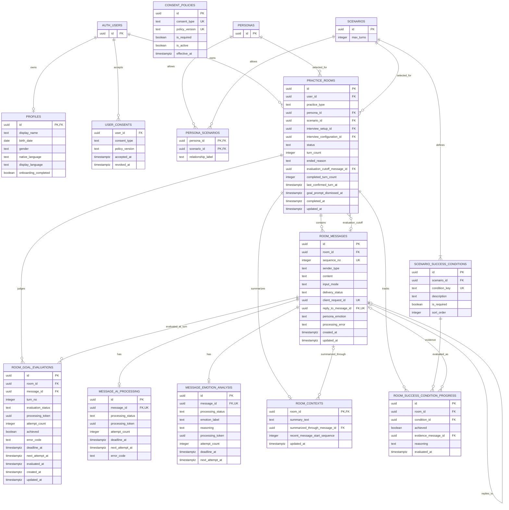
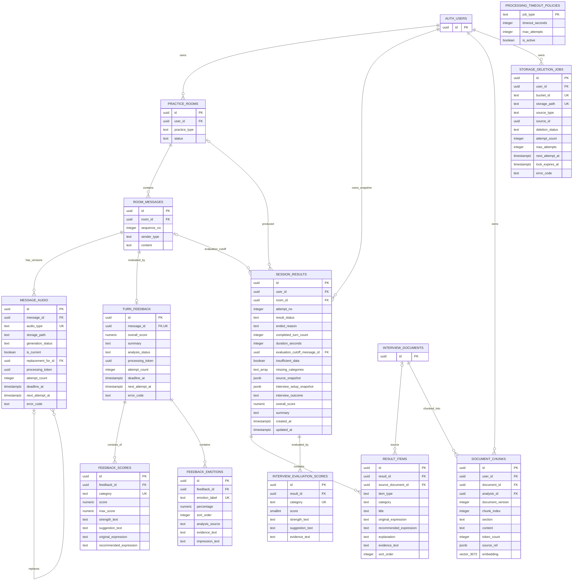
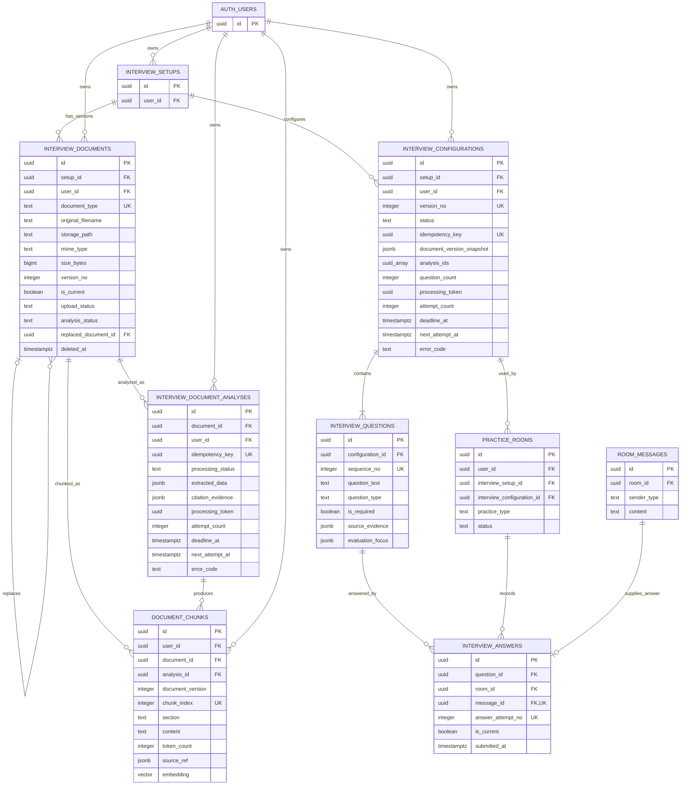
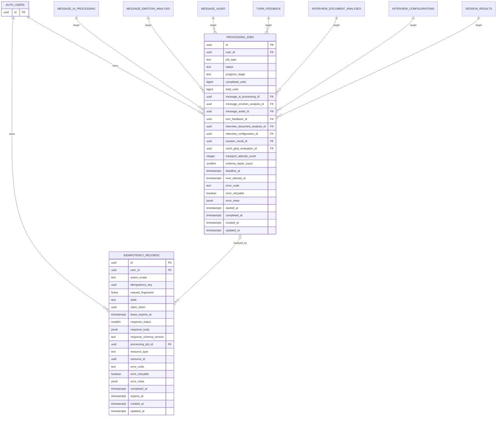
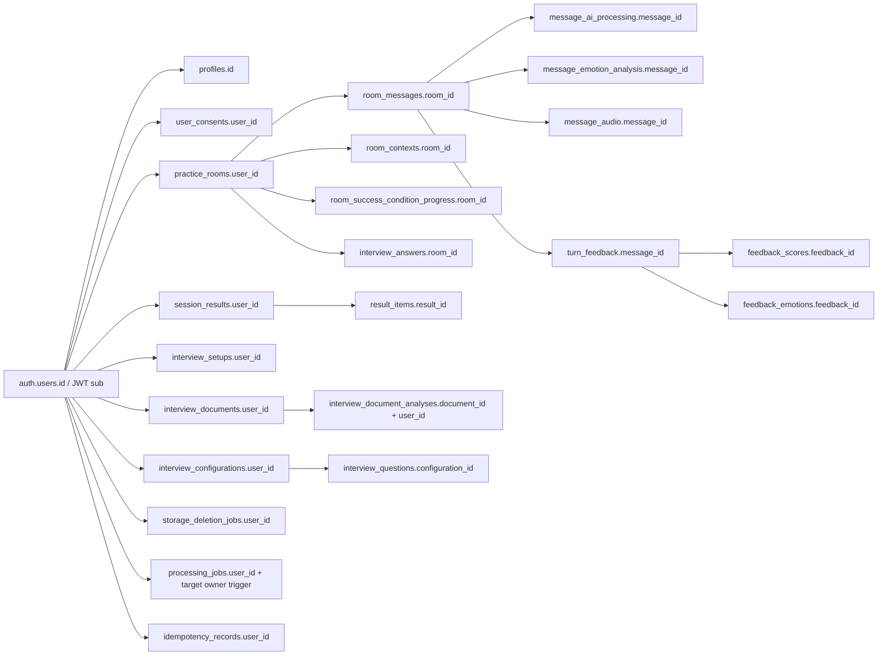

# K-Manner Speech ERD

> 상태: v1.1.0 사용자 종료 반영(`TO-BE`) 기준  
> 기준일: 2026-09-03  
> DB: Supabase Postgres `public` schema + RLS  
> 변경 이력 기준: `supabase/migrations/*.sql`

## 1. 목적과 읽는 법

이 문서는 API·Repository·RLS·삭제 생명주기 설계를 검토하기 위한 논리 ERD다. 한 장에 모든 테이블을 배치하지 않고 다음 네 영역으로 나눈다.

1. 인증·카탈로그·대화
2. 피드백·음성·결과
3. 면접 문서·분석·질문
4. 비동기 실행·멱등성

표기 규칙은 다음과 같다.

- `PK`: Primary Key
- `FK`: Foreign Key
- `UK`: Unique Key 또는 unique index의 일부
- `RLS`: 현재 migration 또는 Supabase 현행 구조에서 RLS로 보호되는 테이블
- 실선 관계는 현재 Supabase 구조 또는 저장소 migration에서 확인한 FK 관계다. FK가 아닌 제품 논리 연결은 각 영역의 설명에서 별도로 표시한다.
- Mermaid ERD는 관계 이해를 위한 논리도다. 정확한 column type, constraint, trigger와 index의 진실 원본은 migration SQL이다.
- 이 저장소의 migration은 기존 기본 테이블을 보강하는 incremental migration이다. 기존 테이블의 최초 `CREATE TABLE`과 일부 기존 FK의 `ON DELETE` 정의는 저장소에 없으므로, 확인되지 않은 삭제 동작은 추정하지 않는다.

## 2. 영역 1 — 인증·카탈로그·대화

### 2.1 핵심 제약과 상태

- `profiles.onboarding_completed = true`이면 이름, 생년월일, 성별, 모국어, UI 언어와 모든 활성 필수 동의가 유효해야 한다.
- `persona_scenarios`는 페르소나와 시나리오의 허용 조합 및 관계 라벨을 보관하는 연결 테이블이다.
- `user_consents.consent_type/policy_version`과 `consent_policies`의 동일 값은 onboarding trigger가 검사하는 논리 연결이다. 실제 DB에는 두 테이블 사이 FK가 없으므로 관계선으로 표현하지 않는다.
- 시나리오 방은 `max_turns > 0`이고 하나 이상의 필수 성공 조건이 있어야 `in_progress`로 시작할 수 있다.
- 활성 방 unique index:
  - 자유채팅: `(user_id, persona_id)`당 활성 방 하나
  - 시나리오: `(user_id, persona_id, scenario_id)`당 활성 방 하나
  - 면접: `(user_id, interview_configuration_id)`당 활성 방 하나
- `room_messages`는 `(room_id, sequence_no)`와 `(room_id, client_request_id)`가 unique다.
- 진행 중인 동일 조합을 다시 선택하면 기존 방을 사용한다. 종료된 방은 활성 방 unique index 대상에서 제외되므로 같은 조합으로 새 방을 만들 수 있고, 기존 방은 목록에서 읽기 전용으로 조회한다.
- 사용자 종료는 연습 유형과 무관하게 `status = 'completed'`, `ended_reason = 'user_ended'`로 기록한다. 면접방도 질문이 남은 채로 끝낼 수 있으며, 이때 `interview_configurations`를 `completed`로 옮기고 결과에 `interview_setup_snapshot`을 남겨 `awaiting_user_end` 이후의 최종 확정과 같은 결과를 만든다.
- `ended_reason`의 신규 canonical 값은 `goal_achieved`, `max_turns_reached`, `interview_completed`, `user_ended`다. `goal_achieved`는 `status = 'in_progress'`인 채로도 나타난다. 시나리오가 제한 턴 전에 필수 성공 조건을 채웠다는 제안 표시이며, 사용자가 종료를 고르면 `completed + user_ended`가 되고 계속을 고르면 `ended_reason`을 `NULL`로 되돌리고 `goal_prompt_dismissed_at`을 기록해 같은 제안을 반복하지 않는다. v1.0.0 데이터와 배포 중 호환을 위해 기존 `completed`, `awaiting_user_end`도 과도기 허용값으로 유지한다.
- 완료 방은 `completed_at`과 `ended_reason`이 반드시 존재한다. `in_progress` 방에는 `completed_at`을 기록하지 않는다.
- `room_goal_evaluations`는 시나리오 조기 목표 판정 Job의 target row다. 사용자 발화가 저장될 때마다 그 메시지와 턴 번호로 한 건을 만들고, Worker가 필수 성공 조건 충족 여부를 `achieved`에 기록한다.
- `room_success_condition_progress`에는 충족한 조건뿐 아니라 충족하지 못한 조건도 `achieved = false` 와 판정 이유로 upsert한다. 한 번 `true`가 된 조건은 이후 판정으로 되돌리지 않는다.
- `evaluation_cutoff_message_id`는 종료 시 종합 피드백에 포함할 마지막 메시지이며, `completed_turn_count`는 같은 시점의 완료 턴 수 snapshot이다. 종료 후 늦게 완료된 AI 처리 결과는 이 기준을 넘어 결과 평가에 포함하지 않는다.
- 면접관의 종료 발화가 저장된 면접방은 최종 완료 확정 전까지 `in_progress`, `ended_reason = 'awaiting_user_end'`를 유지한다. 사용자가 최종 `면접 종료`를 확정하면 `completed`, `ended_reason = 'interview_completed'`로 전환한다.
- AI 응답 처리와 페르소나 감정 분석은 메시지당 각각 하나의 독립 처리 레코드를 가진다.
- `room_contexts`는 방당 하나이며 요약 기준 메시지가 삭제되면 해당 참조만 `NULL`이 된다.

### 2.2 확인된 삭제 정책

| 자식 관계 | `ON DELETE` |
| --- | --- |
| `scenario_success_conditions.scenario_id → scenarios.id` | `CASCADE` |
| `room_messages.reply_to_message_id → room_messages.id` | `CASCADE` |
| `message_ai_processing.message_id → room_messages.id` | `CASCADE` |
| `message_emotion_analysis.message_id → room_messages.id` | `CASCADE` |
| `room_contexts.room_id → practice_rooms.id` | `CASCADE` |
| `room_contexts.summarized_through_message_id → room_messages.id` | `SET NULL` |
| `room_success_condition_progress.room_id → practice_rooms.id` | `CASCADE` |
| `room_success_condition_progress.condition_id → scenario_success_conditions.id` | `RESTRICT` |
| `room_success_condition_progress.evidence_message_id → room_messages.id` | `SET NULL` |
| `room_goal_evaluations.room_id → practice_rooms.id` | `CASCADE` |
| `room_goal_evaluations.message_id → room_messages.id` | `CASCADE` |
| `practice_rooms.evaluation_cutoff_message_id → room_messages.id` | `SET NULL` |

`profiles`, `user_consents`, `practice_rooms`, `room_messages` 등 기존 기본 테이블의 최초 FK 삭제 정책은 현재 저장소의 incremental migration만으로 확정하지 않는다.

## 3. 영역 2 — 피드백·음성·결과

### 3.1 핵심 제약과 상태

- 최종 음성은 `(message_id, audio_type)`별 `is_current = true`인 레코드가 하나만 존재한다.
- `message_audio`, `turn_feedback`은 AI 텍스트 처리와 독립적으로 `processing`·성공·실패 상태 및 retry metadata를 가진다.
- 피드백 점수는 `honorifics`, `courtesy`, `context_fit`, `naturalness` 네 항목이며 각각 0~25 정수다.
- 네 점수가 모두 존재할 때 `turn_feedback.overall_score`는 네 항목 합계로 재계산된다.
- 피드백 감정은 레코드당 최대 세 개이며 `(feedback_id, emotion_label)`이 unique다.
- `session_results`는 방과 독립된 결과 snapshot이다. 방이 삭제되어도 결과는 유지되고 `room_id`만 `NULL`이 된다.
- 결과는 방 종료 당시의 `ended_reason`, `completed_turn_count`, `duration_seconds`, `evaluation_cutoff_message_id`를 복제한다. Worker는 cutoff 이하의 메시지와 완료된 분석만 평가한다.
- 평가 가능한 사용자 발화가 없으면 결과 row는 생성하되 `insufficient_data = true`, `overall_score = NULL`로 저장한다. 사용자 종료 자체는 감점 사유가 아니다.
- `session_results.user_id`가 결과의 최종 owner이며 `result_items`는 부모 결과의 owner를 따른다.
- `result_items.source_document_id`는 면접 문서를 선택적으로 참조해 결과 근거의 출처를 보존한다.
- 면접 평가 category는 `question_understanding_fit`, `answer_structure`, `specificity_evidence`, `job_fit_problem_solving`, `delivery_attitude` 다섯 개로 고정하며 각 점수는 1~20 정수다. `(result_id, category)`는 unique다.
- 면접 점수 다섯 개가 모두 존재할 때만 `session_results.overall_score`는 단순 합계 5~100이고 상태는 `succeeded`다. 일부 누락은 `partial`, 전부 누락은 `failed`이며 두 경우 모두 종합 점수는 `NULL`이고 누락 항목은 `missing_categories`에 기록한다.
- 면접 결과에는 `pass`, `fail`, `합격`, `불합격` 등의 채용 판정을 저장할 수 없다.
- `storage_deletion_jobs.source_id`는 여러 source type을 가리키는 논리 참조이며 FK가 아니다.
- `processing_timeout_policies`는 처리 테이블과 FK로 연결되지 않고 `job_type` 기반 정책으로 사용된다.
- `document_chunks`는 면접 문서 분석 시 생성되는 3072차원 embedding과 owner/document/analysis/version 근거를 저장하며 문서 삭제 시 함께 제거된다.

### 3.2 확인된 삭제 정책

| 자식 관계 | `ON DELETE` |
| --- | --- |
| `message_audio.replacement_for_id → message_audio.id` | `SET NULL` |
| `session_results.room_id → practice_rooms.id` | `SET NULL` |
| `session_results.user_id → auth.users.id` | `CASCADE` |
| `session_results.evaluation_cutoff_message_id → room_messages.id` | `SET NULL` |
| `interview_evaluation_scores.result_id → session_results.id` | `CASCADE` |
| `storage_deletion_jobs.user_id → auth.users.id` | `CASCADE` |

`message_audio.message_id`, `turn_feedback.message_id`, `feedback_scores.feedback_id`, `feedback_emotions.feedback_id`, `result_items.result_id`, `result_items.source_document_id`의 기존 FK 삭제 동작은 현재 저장소의 incremental migration만으로 확정하지 않는다.

## 4. 영역 3 — 면접 문서·분석·질문

### 4.1 핵심 제약과 상태

- 현재 문서는 `(setup_id, document_type)`별 `is_current = true`이고 삭제되지 않은 버전이 하나만 존재한다.
- Service는 `resume`과 `self_introduction`에 PDF 또는 DOCX를 허용하고 `portfolio`에는 PDF만 허용한다. 모든 문서는 10MB 이하이며 확장자, magic bytes, 실제 MIME과 parser 결과가 일치해야 한다.
- 문서 분석은 `(document_id, idempotency_key)`가 unique이며 FK의 `ON DELETE RESTRICT`로 분석이 참조하는 문서 row의 물리 삭제를 막는다. 자료 삭제·교체 API는 문서 row를 `is_current = false`, `deleted_at = now()`로 논리 삭제하고 Storage 원본과 해당 vector만 정리하며 완료된 분석은 보존한다.
- RAG chunk는 `(document_id, document_version, chunk_index)`가 unique이고 원본 정밀도의 3072차원 `vector` embedding을 가진다. HNSW는 2000차원 `vector` 제한을 피하기 위해 검색식과 동일한 `halfvec(3072)` cosine expression index를 사용한다. 검색은 Provider 호출 전에 owner, current document version, similarity threshold를 SQL에서 모두 적용하며 근거가 없으면 질문을 생성하지 않는다.
- `interview_configurations.analysis_ids`는 분석 ID snapshot 배열이며 FK 배열이 아니다. 참조 무결성은 Service/Repository가 검증한다.
- `interview_configurations.document_version_snapshot`은 면접 조건(`conditions`)만 담고 있었으나 그 값이
  어디에서도 쓰이지 않아 제거했다. 지금은 항상 빈 object 를 쓰고 읽지 않는다. 컬럼 제거는 별도 마이그레이션으로 다룬다.
- 질문 깊이는 `interview_setups.application_type`(`신입`·`경력`·`인턴`)으로 정한다. 계약이 생기기 전
  데이터에는 목록 밖의 값이 남아 있으므로 컬럼에 CHECK 제약을 걸지 않고 API 에서 검증한다.
- 면접 설정은 `(setup_id, version_no)`와 `(setup_id, idempotency_key)`가 unique다.
- 한 setup에는 `processing`, `ready`, `in_progress` 상태의 활성 configuration이 하나만 존재한다.
- 질문은 configuration당 1~10개이며 `(configuration_id, sequence_no)`가 unique다. Trigger가 `question_count`를 동기화한다.
- 면접 방은 반드시 `interview_configuration_id`를 가진다. 비면접 방은 해당 컬럼이 `NULL`이어야 한다.
- 답변은 반드시 같은 방의 `sender_type = 'user'` 메시지를 참조하고, 질문도 그 방의 configuration에 속해야 한다.
- 답변 시도는 `(question_id, answer_attempt_no)`가 unique이며 질문당 `is_current = true`인 답변은 하나다.

### 4.2 확인된 삭제 정책

| 자식 관계 | `ON DELETE` |
| --- | --- |
| `interview_documents.replaced_document_id → interview_documents.id` | `SET NULL` |
| `interview_document_analyses.document_id → interview_documents.id` | `RESTRICT` |
| `interview_document_analyses.user_id → auth.users.id` | `CASCADE` |
| `document_chunks.document_id → interview_documents.id` | `CASCADE` |
| `document_chunks.analysis_id → interview_document_analyses.id` | `CASCADE` |
| `document_chunks.user_id → auth.users.id` | `CASCADE` |
| `interview_configurations.setup_id → interview_setups.id` | `CASCADE` |
| `interview_configurations.user_id → auth.users.id` | `CASCADE` |
| `interview_questions.configuration_id → interview_configurations.id` | `CASCADE` |
| `practice_rooms.interview_configuration_id → interview_configurations.id` | `RESTRICT` |
| `interview_answers.question_id → interview_questions.id` | `CASCADE` |
| `interview_answers.room_id → practice_rooms.id` | `CASCADE` |
| `interview_answers.message_id → room_messages.id` | `CASCADE` |

`interview_setups.user_id`와 `interview_documents.setup_id/user_id`의 기존 FK 삭제 동작은 현재 저장소의 incremental migration만으로 확정하지 않는다.

## 5. 영역 4 — 비동기 실행·멱등성

`idempotency_records`의 unique key는 각 column 단독이 아니라 `(user_id, action_scope, idempotency_key)` 복합 unique다.
사용자 종료(`practice_room.complete`)는 현재 `Idempotency-Key`를 받지 않아 `idempotency_records`에 `action_scope`를 남기지 않는다. 종료는 `status = 'in_progress'` 조건부 update 로 직렬화한다.
`account.delete`의 `in_progress` row는 partial unique index로 사용자당 하나만 허용한다. 성공한 Auth hard delete는 사용자 FK cascade로 이 row까지 즉시 삭제하므로 탈퇴 성공 snapshot은 보존하지 않는다.

### 5.1 Job 유형·상태·대상

| `job_type` | 값이 존재해야 하는 단일 target FK | 성공 시 domain 상태 |
| --- | --- | --- |
| `conversation_text` | `message_ai_processing_id` | `succeeded` |
| `emotion_analysis` | `message_emotion_analysis_id` | `succeeded` |
| `tts_generation` | `message_audio_id` | `ready` |
| `turn_feedback` | `turn_feedback_id` | `ready` 또는 `partial` |
| `interview_document_analysis` | `interview_document_analysis_id` | `succeeded` |
| `interview_configuration_generation` | `interview_configuration_id` | `ready` |
| `session_result_generation` | `session_result_id` | `partial` 또는 `succeeded` |
| `scenario_goal_progress` | `room_goal_evaluation_id` | `succeeded` |

- Job 상태는 `queued`, `processing`, `succeeded`, `failed`, `cancelled`다. Job 실행 상태와 domain 결과 상태는 각자의 진실 원본이며 Worker가 한 transaction에서 전이표에 맞게 갱신한다.
- 여덟 target FK 중 정확히 하나만 값이 있어야 하며 `job_type`과 일치해야 한다. 직접 `user_id`와 target owner chain의 최종 소유자는 insert/update trigger로 같음을 강제한다.
- 사용자/API 수준의 retry·regeneration은 새 Job row를 만든다. Provider transport retry와 structured-output repair는 같은 Job의 `transport_attempt_count`, `schema_repair_count`로 기록한다. 동일 target의 활성(`queued|processing`) Job은 최대 하나다.
- `queued`와 terminal 상태에서는 `progress_stage`가 `NULL`이다. 처리 중에는 실제 확인 가능한 단계만 사용하며, 신뢰 가능한 총량이 있을 때만 `completed_units/total_units`를 기록한다. 시간 경과 기반 가짜 백분율은 만들지 않는다.
- terminal Job은 불변이다. 실패에는 공개 가능한 `error_code`, `error_retryable`, allowlist `error_meta`만 저장한다. Provider 원문·프롬프트·응답·stack trace는 저장하지 않는다.
- API의 `result_resource`는 성공 시 target 관계에서 `{type, id}`로 파생한다. 결과 본문과 URL은 Job row에 복제하지 않는다.
- timeout policy key는 위 canonical `job_type`을 사용한다. 현행 runtime에서 `interview_configuration_generation`과 `session_result_generation`은 180초, `scenario_goal_progress`와 `interview_document_analysis`는 60초 deadline을 사용하며 최대 3회 시도한다. Job deadline은 provider client timeout보다 커야 한다.
- 이 표의 `timeout_seconds`는 reaper 가 거둔 job 을 재시도할 때 새 deadline 을 계산하는 데 쓰이고, job 생성 시점의 deadline 은 코드가 정한다. 두 값이 어긋나면 재시도가 다른 예산으로 돌기 때문에 readiness 가 전 job 유형의 값을 대조한다.

### 5.2 진행 단계 허용 목록

| `job_type` | 허용 `progress_stage` |
| --- | --- |
| `conversation_text` | `context_preparing`, `provider_processing`, `saving_response` |
| `emotion_analysis` | `provider_processing`, `saving_analysis` |
| `tts_generation` | `provider_processing`, `storing_audio` |
| `turn_feedback` | `provider_processing`, `saving_feedback` |
| `interview_document_analysis` | `extracting_text`, `chunking`, `embedding`, `saving_analysis` |
| `interview_configuration_generation` | `retrieving_evidence`, `provider_processing`, `saving_configuration` |
| `session_result_generation` | `aggregating_evidence`, `provider_processing`, `saving_result` |
| `scenario_goal_progress` | `provider_processing`, `saving_progress` |

### 5.3 멱등성 상태와 복구

- `idempotency_records.state`는 `in_progress`, `completed`, `failed`다. 최초 요청이 unique insert로 선점한다.
- 같은 key·같은 fingerprint가 처리 중이면 `409 IDEMPOTENCY_REQUEST_IN_PROGRESS`를 반환하며 새 resource/Job을 만들지 않는다. 완료 상태면 생성 당시 schema version의 안전한 HTTP 응답 snapshot을 재생한다. 같은 key의 다른 fingerprint는 `409`다.
- fingerprint는 서버가 action별 canonical payload로 만든 SHA-256이다. 파일은 원문 대신 streaming SHA-256과 안전한 metadata를 포함한다.
- stale claim은 `claim_token + lease_expires_at`의 CAS로 하나의 요청만 인계하며, 기존 resource/Job을 먼저 조정한 뒤 없을 때만 재실행한다.
- 확정적인 non-retryable 4xx는 안전한 snapshot으로 재생한다. 429·일시적 5xx·timeout과 결과가 불명확한 실패는 같은 key로 reconcile-first 복구한다.
- snapshot에는 token, signed URL, 문서·대화 원문, Provider 원본 응답을 저장하지 않는다. action/state별 설정에서 계산한 `expires_at` 이후 batch로 정리한다. 보존시간과 lease 숫자는 로컬 측정 전 임의로 고정하지 않는다.
- `processing_job_id`는 `ON DELETE SET NULL`이다. 여러 domain resource는 `resource_type + resource_id` 논리 locator로 기록하여 원본 삭제 뒤에도 snapshot을 만료까지 재생한다.

### 5.4 삭제·RLS 경계

- 여덟 target FK는 `ON DELETE CASCADE`다. Service가 먼저 queue cleanup과 stale guard를 수행한 뒤 target을 삭제한다. 삭제된 Job polling은 `404`이며 별도 Job audit row는 보존하지 않는다.
- `processing_jobs`는 `authenticated`의 owner `SELECT` RLS만 허용한다. insert/update/delete는 API/Worker 전용이다.
- `idempotency_records`에는 Browser용 policy나 권한이 없다. fingerprint, claim, replay snapshot은 Repository/서버만 다룬다.
- 두 테이블의 `user_id`는 `auth.users.id ON DELETE CASCADE`다. 다른 사용자 소유와 미존재 resource는 API에서 동일한 `404`로 처리한다.

### 5.5 Worker heartbeat

`worker_heartbeats`는 `(worker_id, queue_name)` 복합 primary key와 `started_at`, `last_seen_at`을 가진 서버 내부 운영 테이블이다. `queue_name`은 `conversation_text`, `interactive_ai`, `evaluation_ai`, `document_analysis`만 허용한다. Worker는 같은 key를 upsert하며 API readiness는 필수 queue마다 `WORKER_HEARTBEAT_TTL_SECONDS` 이내의 row가 하나 이상 있는지 검사한다.

이 테이블은 RLS를 활성화하되 Browser policy를 만들지 않으며 `anon`, `authenticated`의 모든 권한을 회수한다. heartbeat TTL은 측정값이므로 DB default나 코드 default를 두지 않는다.

## 6. 사용자 소유권 경로

FastAPI는 아래 경로를 Repository query의 동일 predicate 또는 `JOIN/EXISTS` 안에서 검증한다. RLS는 `public` Data API 접근에 대한 추가 방어 계층이며 이 검사를 대신하지 않는다.

### 6.1 RLS/Repository 기준

| 소유권 유형 | 대표 테이블 | 판정 기준 |
| --- | --- | --- |
| 직접 사용자 소유 | `profiles`, `practice_rooms`, `session_results`, `interview_documents`, `interview_document_analyses`, `interview_configurations`, `storage_deletion_jobs`, `processing_jobs`, `idempotency_records` | `user_id = authenticated_user_id` 또는 `id = authenticated_user_id` |
| Job 이중 소유 검증 | `processing_jobs` | 직접 `user_id`와 type별 target owner chain이 모두 인증 사용자와 일치 |
| 방을 통한 간접 소유 | `room_messages`, `message_ai_processing`, `message_emotion_analysis`, `message_audio`, `turn_feedback`, `room_contexts`, `room_success_condition_progress`, `interview_answers` | `resource → room_messages/practice_rooms → practice_rooms.user_id` |
| 결과를 통한 간접 소유 | `result_items` | `result_items.result_id → session_results.user_id` |
| 면접 configuration을 통한 간접 소유 | `interview_questions` | `question.configuration_id → interview_configurations.user_id` |
| 인증 사용자 공용 읽기 | `consent_policies`, `scenario_success_conditions` 및 활성 catalog | `authenticated` read policy와 server-side active/allowed filter |
| 서버 내부 정책·재생 데이터 | `processing_timeout_policies`, `idempotency_records` | Browser CRUD 대상이 아니며 API/worker가 정책·중복 방지에 사용 |

다른 사용자 소유와 실제 미존재 리소스는 FastAPI에서 동일한 `404` 계약을 사용한다. 생성 요청의 `user_id`, `owner_id`, Storage object key는 신뢰하지 않고 JWT subject와 서버 생성값으로 확정한다.

## 7. 삭제·보존 경계 요약

| 삭제 대상 | 보존 또는 정리 원칙 |
| --- | --- |
| 대화방 | 메시지와 방 종속 처리 상태·맥락·진행률·면접 답변은 종속 삭제 대상이다. 실제 삭제 전에 진행 중 worker 결과를 stale 처리한다. |
| 세션 결과 | 방과 독립된 snapshot으로 보존한다. 방 삭제 시 `session_results.room_id`만 `NULL`이 된다. |
| 면접 문서 | 삭제·교체 시 문서 row를 논리 삭제하고 Storage 원본·해당 vector와 진행 중 Job을 정리하며 완료된 분석은 보존한다. 분석이 참조 중인 문서의 물리 삭제는 `RESTRICT`된다. 삭제된 원본과 보존 분석은 새 분석·면접 구성 입력으로 재사용하지 않는다. |
| 생성 음성 | 교체된 Storage object는 즉시 영구 삭제하고 DB에는 current version을 하나만 유지한다. |
| 회원 탈퇴 | 사용자 소유 문서와 분석을 포함한 DB row, Storage object, vector, Job을 모두 영구 삭제한다. `storage.objects`에서 private bucket의 `{user_id}/` prefix를 inventory하되 실제 삭제는 Storage API로 수행한다. 일부 삭제만 완료된 상태를 성공으로 반환하지 않는다. |
| Storage 삭제 작업 | `(bucket_id, storage_path)`당 하나의 durable claim으로 재시도하며 source FK 대신 `source_type/source_id` 논리 참조를 사용한다. |
| 공통 Job | 사용자 또는 target 삭제 시 `CASCADE`; 삭제 전 queue cleanup·stale guard를 수행하며 별도 audit row는 보존하지 않는다. |
| 멱등 기록 | 사용자 삭제 시 `CASCADE`; Job 삭제 시 FK만 `SET NULL`; 일반 action의 논리 resource locator와 안전한 snapshot은 `expires_at`까지 유지한다. `account.delete` 성공 기록은 사용자와 함께 즉시 삭제하는 예외다. |

## 8. API 설계 시 확인할 경계

- API DTO는 이 ERD의 persistence column을 그대로 노출하지 않는다. 특히 `user_id`, processing token, Storage path와 내부 error message는 서버 내부 값이다.
- `claim_token`, `request_fingerprint`, `lease_expires_at`, 응답 snapshot과 Provider 원본 오류도 API DTO에 노출하지 않는다. Job API는 안전한 `type/status/progress/error/result_resource`만 노출한다.
- 면접 준비 단위 생성, `POST /rooms`, 메시지 전송, AI 응답·감정·피드백·TTS retry, 문서 업로드·교체·분석, 결과 retry와 삭제는 `Idempotency-Key`를 사용한다. 면접 준비 생성의 `action_scope`는 `interview_setup.create`다. 종료 계열 endpoint 는 현재 `Idempotency-Key`를 받지 않는다.
- 비동기 처리 상태는 AI 응답, 감정, 음성, 피드백, 문서 분석, 면접 configuration별로 독립적으로 표현한다.
- 목록 cursor는 반드시 인증 사용자 소유 집합 안에서 계산한다.
- 문서 version, 분석, 면접 configuration과 결과 snapshot은 API 응답에서 각각의 식별자와 사용 version을 명확히 구분한다.
- ERD와 실제 Supabase가 다르면 Supabase에 적용된 migration 결과를 우선 확인하고, 차이를 새 migration과 이 문서에 함께 반영한다.

## 9. 관련 문서와 변경 원본

- `docs/PRD.md`
- `docs/화면기획서.md`
- `docs/아키텍처.md`
- `docs/PROJECT_STRUCTURE_V5.md`
- `supabase/migrations/20260824060000_screen_plan_contract.sql`
- `supabase/migrations/20260824063000_result_snapshot_ownership_fix.sql`
- `supabase/migrations/20260824070000_priorities_3_4_5_6_schema.sql`
- `supabase/migrations/20260825090000_processing_jobs_and_idempotency.sql`
- `supabase/migrations/20260825100000_add_session_result_timeout_policy.sql`
- `supabase/migrations/20260903150000_add_user_ended_room_snapshots.sql`

스키마 변경 시 migration과 이 문서를 같은 변경 단위에서 갱신한다. 운영 전환 전 비노출 `app` schema로 이전한다면 이 문서는 `TO-BE` ERD가 아니라 새 실제 상태를 나타내도록 함께 개정한다.
